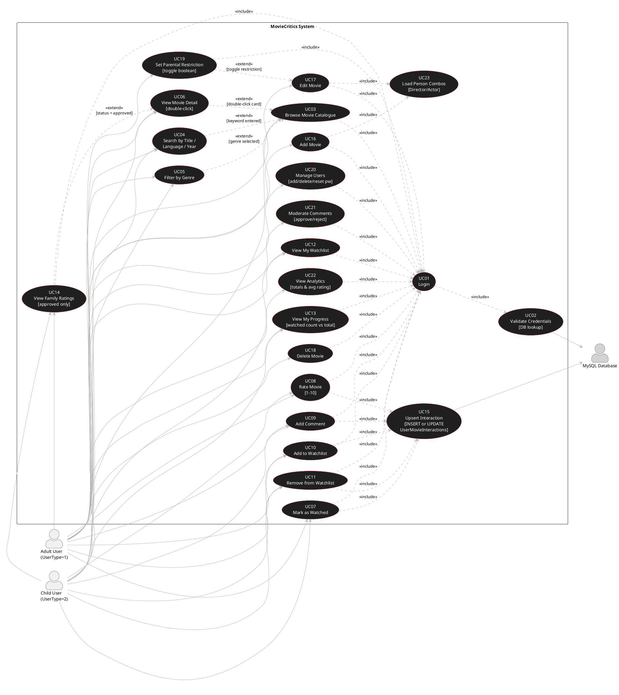
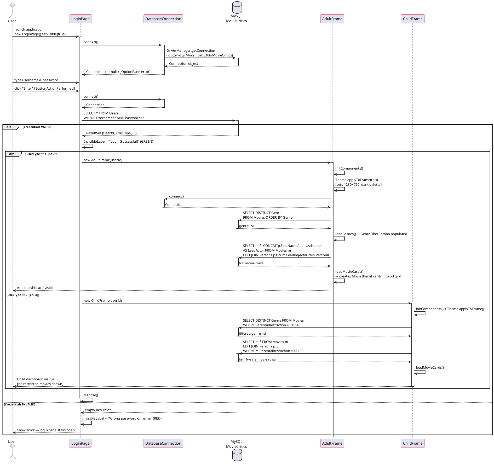
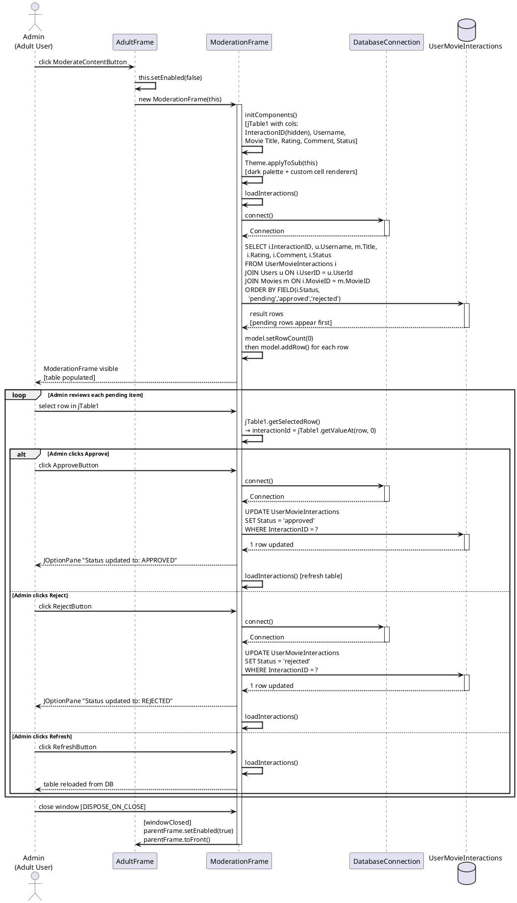
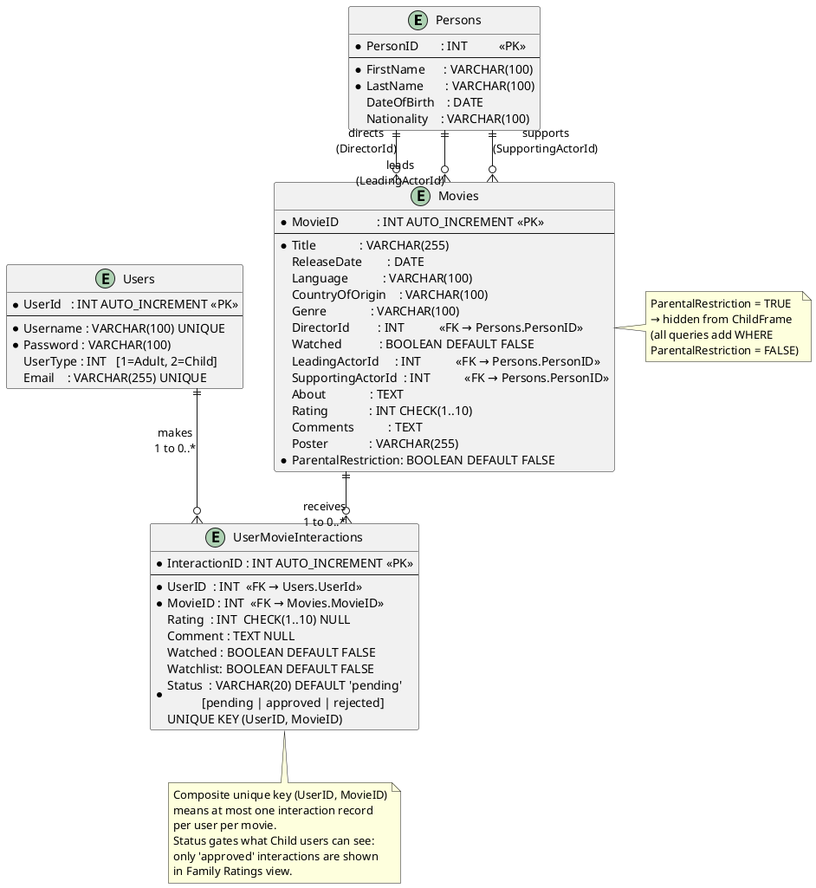
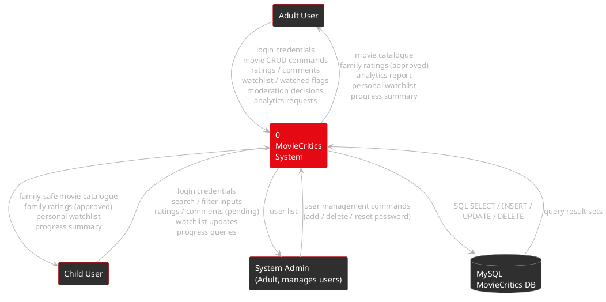
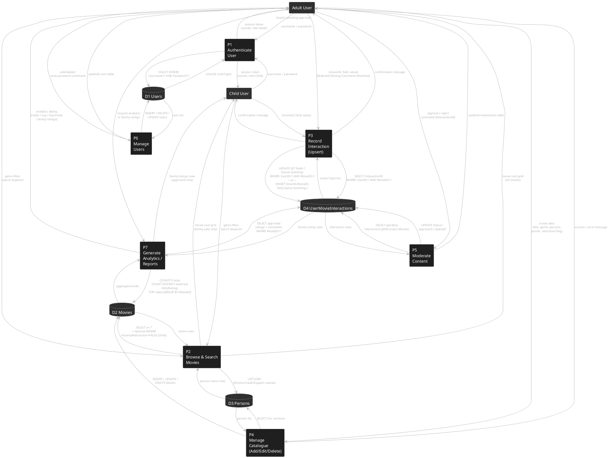

# MovieCritics System — UML & DFD Diagrams

> **Stack:** Java 17 · Swing (Nimbus LAF) · MySQL 8 · JDBC (`com.mysql.cj.jdbc.Driver`)  
> **Database:** `MovieCritics` — tables: `Persons`, `Movies`, `Users`, `UserMovieInteractions`

---

## 1. Use Case Diagram

---

## 2. Class Diagram

```plantuml
@startuml CD_MovieCritics
skinparam classAttributeIconSize 0
skinparam linetype ortho
skinparam class {
  BackgroundColor #1F1F1F
  BorderColor #E50914
  FontColor #FFFFFF
  ArrowColor #B3B3B3
}

abstract class JFrame <<javax.swing>>
abstract class JPanel <<javax.swing>>

'─────────────────────────────
' View layer
'─────────────────────────────
class LoginPage {
  - NameTextField    : JTextField
  - PasswordTextField: JPasswordField
  - LoginText        : JLabel
  - InvisibleLabel   : JLabel
  - Button           : JButton
  --
  + LoginPage()
  - ButtonActionPerformed(evt : ActionEvent) : void
  ' Reads Username+Password → SELECT Users WHERE Username=? AND Password=?
  ' Routes to AdultFrame (type=1) or ChildFrame (type=2)
}

class AdultFrame {
  - userId            : int
  - selectedMovieId   : int = -1
  - selectedCardPanel : JPanel
  --
  + AdultFrame(userId : int)
  - loadGenres()      : void
  ' SELECT DISTINCT Genre FROM Movies ORDER BY Genre
  - loadMovieCards()  : void
  ' SELECT m.*,CONCAT(p.FirstName,' ',p.LastName) AS LeadActor
  ' FROM Movies m LEFT JOIN Persons p ON m.LeadingActorId=p.PersonID
  ' optional WHERE Title/Language/Year LIKE keyword, Genre=?
  - showMovieDetail(movieId : int)  : void
  ' JOIN Persons d/la/sa ON DirectorId/LeadingActorId/SupportingActorId
  - deleteSelectedMovie()           : void
  ' DELETE FROM Movies WHERE MovieID=?
  - toggleParentalRestriction()     : void
  ' UPDATE Movies SET ParentalRestriction=NOT ParentalRestriction WHERE MovieID=?
  - showAnalytics()                 : void
  ' COUNT(*) total, COUNT DISTINCT watched, AVG(Rating), TOP rated movie
  - showFamilyRatings(movieId : int): void
  ' SELECT u.Username,i.Rating,i.Comment WHERE Status='approved'
}

class ChildFrame {
  - userId            : int
  - selectedMovieId   : int = -1
  - selectedCardPanel : JPanel
  --
  + ChildFrame(userId : int)
  - loadGenres()      : void
  ' SELECT DISTINCT Genre WHERE ParentalRestriction=FALSE
  - loadMovieCards()  : void
  ' WHERE ParentalRestriction=FALSE [+ keyword + genre filters]
  - showMovieDetail(movieId : int)      : void
  - upsertInteraction(movieId : int,\n    field : String, value : Object) : void
  ' SELECT InteractionID → UPDATE or INSERT UserMovieInteractions
  ' Always sets Status='pending'
  - showWatchlist()   : void
  ' SELECT Movies JOIN Interactions WHERE Watchlist=TRUE
  - showProgress()    : void
  ' COUNT available, COUNT watched by user, family leaderboard
  - showFamilyRatings(movieId : int)    : void
  ' Status='approved' only
}

class AddMovieForm {
  - parentFrame         : Frame
  - TitleTextField      : JTextField
  - LanguageTextField   : JTextField
  - ReleaseDateTextField: JTextField
  - RatingTextField     : JTextField
  - CountryTextField    : JTextField
  - PosterTextField     : JTextField
  - aboutArea           : JTextArea
  - commentsArea        : JTextArea
  - genreCombo          : JComboBox<String>
  - directorCombo       : JComboBox<String>
  - leadingActorCombo   : JComboBox<String>
  - supportingActorCombo: JComboBox<String>
  - restrictionCheckBox : JCheckBox
  --
  + AddMovieForm(parent : Frame)
  - loadPersonsToCombo() : void
  ' SELECT PersonID,CONCAT(FirstName,' ',LastName) FROM Persons
  - SaveButtonActionPerformed(evt : ActionEvent) : void
  ' INSERT INTO Movies(Title,ReleaseDate,Language,CountryOfOrigin,
  '   Genre,DirectorId,LeadingActorId,SupportingActorId,
  '   About,Rating,Comments,Poster,ParentalRestriction)
}

class EditMovieForm {
  - movieId              : int
  - parentFrame          : Frame
  ' Same fields as AddMovieForm
  --
  + EditMovieForm(movieId : int, parent : Frame)
  - loadMovieData()      : void
  ' SELECT m.*,p.PersonID aliased director/lead/support
  ' FROM Movies m LEFT JOIN Persons x3
  - SaveButtonActionPerformed(evt : ActionEvent) : void
  ' UPDATE Movies SET Title=?,ReleaseDate=?,... WHERE MovieID=?
  - loadPersonsToCombo() : void
}

class ModerationFrame {
  - parentFrame : Frame
  - jTable1     : JTable
  --
  + ModerationFrame(parent : Frame)
  - loadInteractions() : void
  ' SELECT i.InteractionID,u.Username,m.Title,i.Rating,i.Comment,i.Status
  ' FROM UserMovieInteractions i JOIN Users JOIN Movies
  ' ORDER BY FIELD(i.Status,'pending','approved','rejected')
  - updateStatus(newStatus : String) : void
  ' UPDATE UserMovieInteractions SET Status=? WHERE InteractionID=?
}

class ManageUsersFrame {
  - parentFrame : Frame
  - jTable1     : JTable
  --
  + ManageUsersFrame(parent : Frame)
  - loadUsers()         : void
  ' SELECT UserId,Username,Email,UserType FROM Users
  - addUser()           : void
  ' INSERT INTO Users(Username,Password,UserType,Email)
  - deleteUser()        : void
  ' DELETE FROM Users WHERE UserId=?
  - resetPassword()     : void
  ' UPDATE Users SET Password=? WHERE UserId=?
}

'─────────────────────────────
' UI Component
'─────────────────────────────
class Movie <<JPanel card>> {
  - movieId   : int
  --
  + Movie(id : int, title : String,\n    poster : String, rating : int,\n    leadActor : String,\n    restricted : boolean,\n    genre : String)
  + getMovieId() : int
  ' Loads poster from posters/<filename>
  ' Shows RESTRICTED (red) or FAMILY (grey) badge
}

'─────────────────────────────
' Infrastructure
'─────────────────────────────
class DatabaseConnection {
  - URL      : String = "jdbc:mysql://localhost:3306/MovieCritics" {static}
  - USER     : String = "root" {static}
  - PASSWORD : String {static}
  --
  + connect() : Connection {static}
  ' Class.forName("com.mysql.cj.jdbc.Driver")
  ' DriverManager.getConnection(URL, USER, PASSWORD)
}

class Theme {
  + BG       : Color = #141414 {static}
  + SURFACE  : Color = #1F1F1F {static}
  + SURFACE2 : Color = #2F2F2F {static}
  + RED      : Color = #E50914 {static}
  + TEXT     : Color = #FFFFFF {static}
  + TEXT_DIM : Color = #B3B3B3 {static}
  --
  + apply(container : Container)    : void {static}
  ' Recursively styles JLabel/JButton/JTextField
  ' JComboBox/JScrollPane(JTable|JTextArea)/JPanel
  + applyToFrame(frame : JFrame)    : void {static}
  ' Sets 1280×720, centres, calls apply()
  + applyToSub(frame : JFrame)      : void {static}
  ' No resize — for modal sub-windows
  + styleCard(card : JPanel)        : void {static}
  + selectCard(card : JPanel)       : void {static}
  ' RED border 2px
  + deselectCard(card : JPanel)     : void {static}
  - styleTable(table : JTable)      : void {static}
  ' Custom DefaultTableCellRenderer for cells AND header
  ' Nimbus LAF ignores setBackground — renderer is required
}

enum Genre {
  ACTION
  ADVENTURE
  ANIMATION
  COMEDY
  CRIME
  DOCUMENTARY
  DRAMA
  FANTASY
  HORROR
  MUSICAL
  MYSTERY
  ROMANCE
  SCIENCE_FICTION
  THRILLER
  WAR
  WESTERN
  --
  - displayName : String
  --
  + getDisplayName() : String
  + fromString(value : String) : Genre {static}
  + toString() : String
}

'─────────────────────────────
' Inheritance
'─────────────────────────────
JFrame <|-- LoginPage
JFrame <|-- AdultFrame
JFrame <|-- ChildFrame
JFrame <|-- AddMovieForm
JFrame <|-- EditMovieForm
JFrame <|-- ModerationFrame
JFrame <|-- ManageUsersFrame
JPanel <|-- Movie

'─────────────────────────────
' Dependencies & associations
'─────────────────────────────
LoginPage    ..>  DatabaseConnection : <<use>>
LoginPage    ..>  AdultFrame         : <<create>>\n[userType=1]
LoginPage    ..>  ChildFrame         : <<create>>\n[userType=2]

AdultFrame   ..>  DatabaseConnection : <<use>>
AdultFrame   ..>  AddMovieForm       : <<create>>
AdultFrame   ..>  EditMovieForm      : <<create>>
AdultFrame   ..>  ModerationFrame    : <<create>>
AdultFrame   ..>  ManageUsersFrame   : <<create>>
AdultFrame   "1" o-- "0..*" Movie   : contains

ChildFrame   ..>  DatabaseConnection : <<use>>
ChildFrame   "1" o-- "0..*" Movie   : contains

AddMovieForm ..>  DatabaseConnection : <<use>>
AddMovieForm ..>  Genre              : <<use>>

EditMovieForm ..> DatabaseConnection : <<use>>
EditMovieForm ..> Genre              : <<use>>

ModerationFrame  ..> DatabaseConnection : <<use>>
ManageUsersFrame ..> DatabaseConnection : <<use>>

AdultFrame   ..> Theme : <<use>>
ChildFrame   ..> Theme : <<use>>
LoginPage    ..> Theme : <<use>>
ModerationFrame  ..> Theme : <<use>>
ManageUsersFrame ..> Theme : <<use>>
Movie        ..> Theme : <<use>>
@enduml
```

---

## 3. Sequence Diagram — Authentication & Routing

---

## 4. Sequence Diagram — User Movie Interaction (Rate / Comment / Watch / Watchlist)

```plantuml
@startuml SEQ_Interact
skinparam sequenceArrowThickness 2

actor "User\n(Adult or Child)" as U
participant "AdultFrame /\nChildFrame"  as F
participant "DatabaseConnection"        as DC
database    "UserMovieInteractions"     as UMI
database    "Movies"                    as MOV

== Select a movie card ==
U -> F  : click Movie card [mouseClicked]
F -> F  : if selectedCardPanel != null\n  Theme.deselectCard(prev)
F -> F  : selectedMovieId = card.getMovieId()
F -> F  : Theme.selectCard(card)\n[RED border 2px]

opt Double-click → show detail
  U -> F : double-click card
  F -> DC : connect()
  activate DC
  DC --> F : Connection
  deactivate DC
  F -> MOV : SELECT m.*, YEAR(m.ReleaseDate),\nCONCAT(d/la/sa) AS Director/Lead/Support\nFROM Movies m LEFT JOIN Persons x3\nWHERE m.MovieID = ?
  activate MOV
  MOV --> F : full detail row
  deactivate MOV
  F --> U : JOptionPane with Title/Year/Genre\nLanguage/Country/Director\nLead/Support/Rating/Watched/Comments
end

== Interaction buttons ==

alt [Mark Watched]
  U -> F : click MarkWatchedButton
  F -> F : guard: selectedMovieId == -1 → show "Select a movie first!"
  F -> F : upsertInteraction(movieId, "Watched", true)
  F -> DC : connect()
  activate DC
  DC --> F : Connection
  deactivate DC
  F -> UMI : SELECT InteractionID\nWHERE UserID=? AND MovieID=?
  activate UMI
  alt row EXISTS
    UMI --> F : InteractionID found
    deactivate UMI
    F -> UMI : UPDATE UserMovieInteractions\nSET Watched=TRUE, Status='pending'\nWHERE UserID=? AND MovieID=?
    activate UMI
    UMI --> F : 1 row updated
    deactivate UMI
  else NO row
    UMI --> F : empty
    deactivate UMI
    F -> UMI : INSERT INTO UserMovieInteractions\n(UserID, MovieID, Watched, Status)\nVALUES (?,?,TRUE,'pending')
    activate UMI
    UMI --> F : 1 row inserted
    deactivate UMI
  end
  F --> U : JOptionPane "Marked as watched!"
  F -> F  : loadMovieCards() [refresh grid]

else [Rate Movie]
  U -> F : click RateMovieButton
  F -> F : guard: selectedMovieId == -1 → show warning
  F -> U : JOptionPane.showInputDialog "Enter rating (1-10):"
  U -> F : enters score string

  opt user cancels
    F --> U : no action
  end

  F -> F : score = Integer.parseInt(input)
  alt score < 1 OR score > 10
    F --> U : JOptionPane "Rating must be between 1-10!"
  else valid score
    F -> F  : upsertInteraction(movieId, "Rating", score)
    F -> UMI : SELECT / UPDATE or INSERT\n[same upsert as above, field="Rating"]
    activate UMI
    UMI --> F : ok
    deactivate UMI
    F --> U : JOptionPane "Rating pending approval"
  end

else [Add Comment]
  U -> F : click AddCommentButton
  F -> F : guard: selectedMovieId == -1 → show warning
  F -> U : JOptionPane.showInputDialog "Enter your comment:"
  U -> F : enters text string
  opt user cancels or empty
    F --> U : no action
  end
  F -> F  : upsertInteraction(movieId, "Comment", text.trim())
  F -> UMI : SELECT / UPDATE or INSERT\n[field="Comment"]
  activate UMI
  UMI --> F : ok
  deactivate UMI
  F --> U : JOptionPane "Comment pending approval"

else [Add to Watchlist]
  U -> F : click AddWatchlistButton
  F -> F  : upsertInteraction(movieId, "Watchlist", true)
  F -> UMI : SELECT / UPDATE or INSERT\n[field="Watchlist", value=TRUE]
  activate UMI
  UMI --> F : ok
  deactivate UMI
  F --> U : JOptionPane "Added to watchlist!"

else [Remove from Watchlist]
  U -> F : click RemoveWatchlistButton
  F -> F  : upsertInteraction(movieId, "Watchlist", false)
  F -> UMI : UPDATE Watchlist=FALSE\nWHERE UserID=? AND MovieID=?
  activate UMI
  UMI --> F : ok
  deactivate UMI
  F --> U : JOptionPane "Removed from watchlist!"
end

== Progress / Watchlist views ==

alt [My Watchlist]
  U -> F : click WatchlistButton
  F -> DC : connect()
  activate DC
  DC --> F : Connection
  deactivate DC
  F -> UMI : SELECT m.Title, m.Genre, m.Rating\nFROM Movies m JOIN UserMovieInteractions i\nON m.MovieID=i.MovieID\nWHERE i.UserID=? AND i.Watchlist=TRUE\nORDER BY m.Title
  activate UMI
  UMI --> F : list rows
  deactivate UMI
  F --> U : JOptionPane formatted watchlist

else [My Progress]
  U -> F : click ProgressButton
  F -> DC : connect()
  activate DC
  DC --> F : Connection
  deactivate DC
  F -> MOV : COUNT(*) WHERE ParentalRestriction=FALSE
  activate MOV
  MOV --> F : total available
  deactivate MOV
  F -> UMI : COUNT(*) WHERE UserID=? AND Watched=TRUE
  activate UMI
  UMI --> F : myWatched
  deactivate UMI
  F -> UMI : SELECT u.Username, COUNT(i.InteractionID)\nFROM Users u LEFT JOIN Interactions i\nWHERE u.UserType=2 GROUP BY u.UserId\nORDER BY watched DESC
  activate UMI
  UMI --> F : family leaderboard
  deactivate UMI
  F --> U : JOptionPane with total / watched / remaining\n+ family leaderboard
end
@enduml
```

---

## 5. Sequence Diagram — Admin Movie Management (Add / Edit / Delete)

```plantuml
@startuml SEQ_Admin
skinparam sequenceArrowThickness 2

actor "Admin\n(Adult User)" as A
participant "AdultFrame"    as AF
participant "AddMovieForm"  as AMF
participant "EditMovieForm" as EMF
participant "DatabaseConnection" as DC
database    "Movies"  as MOV
database    "Persons" as PER

== Add Movie ==
A -> AF : click AddMovieButton
AF -> AF : this.setEnabled(false)
AF -> AMF : new AddMovieForm(this)
activate AMF
AMF -> AMF : initComponents()
AMF -> AMF : genreCombo.setModel(\n  new DefaultComboBoxModel<>()\n  populated from Genre.values())
AMF -> DC : connect()
activate DC
DC --> AMF : Connection
deactivate DC
AMF -> PER : SELECT PersonID,\nCONCAT(FirstName,' ',LastName)\nFROM Persons ORDER BY LastName
activate PER
PER --> AMF : person rows
deactivate PER
AMF -> AMF : loadPersonsToCombo()\n→ directorCombo / leadingActorCombo\n  / supportingActorCombo populated
AMF -> AMF : Theme.applyToSub(this)
AMF --> A  : AddMovieForm visible

A -> AMF : fill Title, Genre, Language, ReleaseDate\nRating, Country, Poster, About,\nComments, DirectorId, LeadActor,\nSupportActor, ParentalRestriction checkbox
A -> AMF : click Save

AMF -> DC : connect()
activate DC
DC --> AMF : Connection
deactivate DC
AMF -> MOV : INSERT INTO Movies\n(Title, ReleaseDate, Language, CountryOfOrigin,\n Genre, DirectorId, LeadingActorId,\n SupportingActorId, About, Rating,\n Comments, Poster, ParentalRestriction)\nVALUES (?, ?, ?, ?, ?, ?, ?, ?, ?, ?, ?, ?, ?)
activate MOV
MOV --> AMF : 1 row inserted
deactivate MOV
AMF --> A  : JOptionPane "Movie added!"
AMF -> AMF : dispose()
deactivate AMF
AMF -> AF  : [windowClosed] parentFrame.setEnabled(true)
AF  -> AF  : loadMovieCards() [refresh grid]

== Edit Movie ==
A -> AF  : select movie card, click EditMovieButton
AF -> AF : guard: selectedMovieId == -1 → warning
AF -> AF : this.setEnabled(false)
AF -> EMF : new EditMovieForm(selectedMovieId, this)
activate EMF
EMF -> DC : connect()
activate DC
DC --> EMF : Connection
deactivate DC
EMF -> MOV : SELECT m.*, YEAR(m.ReleaseDate),\nCONCAT(d/la/sa names)\nFROM Movies m LEFT JOIN Persons x3\nWHERE m.MovieID = ?
activate MOV
MOV --> EMF : full movie row
deactivate MOV
EMF -> EMF : pre-fill all form fields\nwith current values
EMF -> PER : SELECT persons for combos
activate PER
PER --> EMF : person rows
deactivate PER
EMF -> AMF : Theme.applyToSub(this)
EMF --> A  : EditMovieForm prefilled

A -> EMF : modify fields as needed
A -> EMF : click Save
EMF -> DC : connect()
activate DC
DC --> EMF : Connection
deactivate DC
EMF -> MOV : UPDATE Movies\nSET Title=?, ReleaseDate=?, Language=?,\n CountryOfOrigin=?, Genre=?,\n DirectorId=?, LeadingActorId=?,\n SupportingActorId=?, About=?,\n Rating=?, Comments=?, Poster=?,\n ParentalRestriction=?\nWHERE MovieID=?
activate MOV
MOV --> EMF : 1 row updated
deactivate MOV
EMF --> A  : JOptionPane "Movie updated!"
EMF -> EMF : dispose()
deactivate EMF
EMF -> AF  : [windowClosed] parentFrame.setEnabled(true)
AF  -> AF  : loadMovieCards()

== Delete Movie ==
A -> AF : select movie card, click DeleteMovieButton
AF -> AF : guard: selectedMovieId == -1 → warning
AF -> A  : JOptionPane.showConfirmDialog\n"Delete this movie?"
alt User clicks NO
  A --> AF : no action
else User clicks YES
  AF -> DC : connect()
  activate DC
  DC --> AF : Connection
  deactivate DC
  AF -> MOV : DELETE FROM Movies\nWHERE MovieID = ?
  activate MOV
  MOV --> AF : 1 row deleted
  deactivate MOV
  AF --> A  : JOptionPane "Deleted!"
  AF -> AF  : selectedMovieId = -1
  AF -> AF  : loadMovieCards() [refresh grid]
end

== Toggle Parental Restriction ==
A -> AF : select movie card, click SetRestrictionButton
AF -> AF : guard: selectedMovieId == -1 → warning
AF -> DC : connect()
activate DC
DC --> AF : Connection
deactivate DC
AF -> MOV : UPDATE Movies\nSET ParentalRestriction =\n  NOT ParentalRestriction\nWHERE MovieID = ?
activate MOV
MOV --> AF : 1 row updated
deactivate MOV
AF --> A  : JOptionPane "Restriction changed!"
AF -> AF  : loadMovieCards() [grid refreshes\n — card re-renders RESTRICTED/FAMILY badge]
@enduml
```

---

## 6. Sequence Diagram — Content Moderation

---

## 7. Entity-Relationship Diagram

---

## 8. Data Flow Diagram — Level 0 (Context Diagram)

---

## 9. Data Flow Diagram — Level 1 (Process Decomposition)

---

### Rendering these diagrams

Paste any block into [PlantUML Online](https://www.plantuml.com/plantuml/uml/) or import via **Visual Paradigm → Tools → Import PlantUML**.  
All diagrams use only standard PlantUML constructs (`@startuml … @enduml`) with no external libraries.
